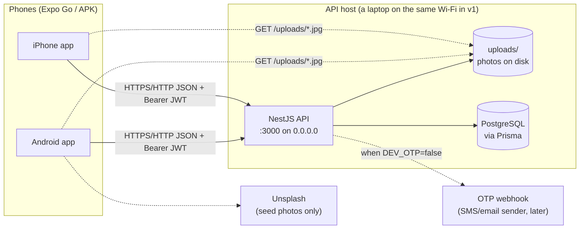
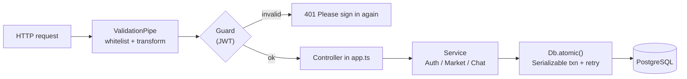
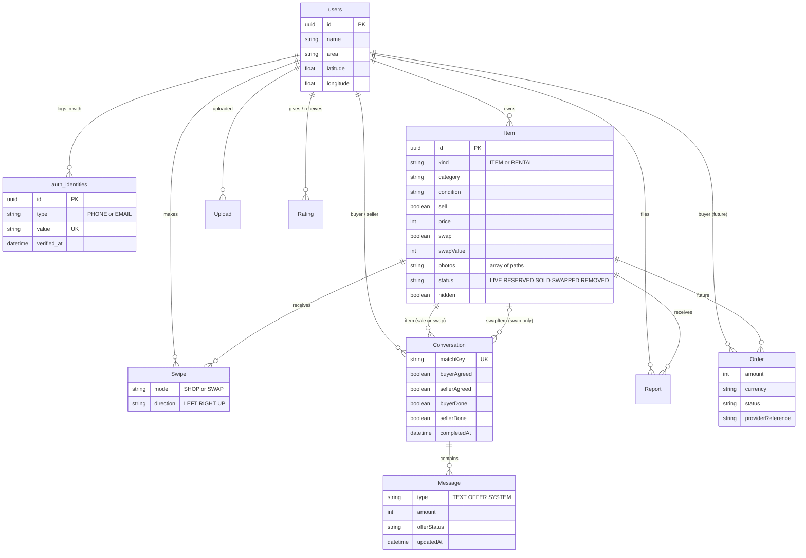
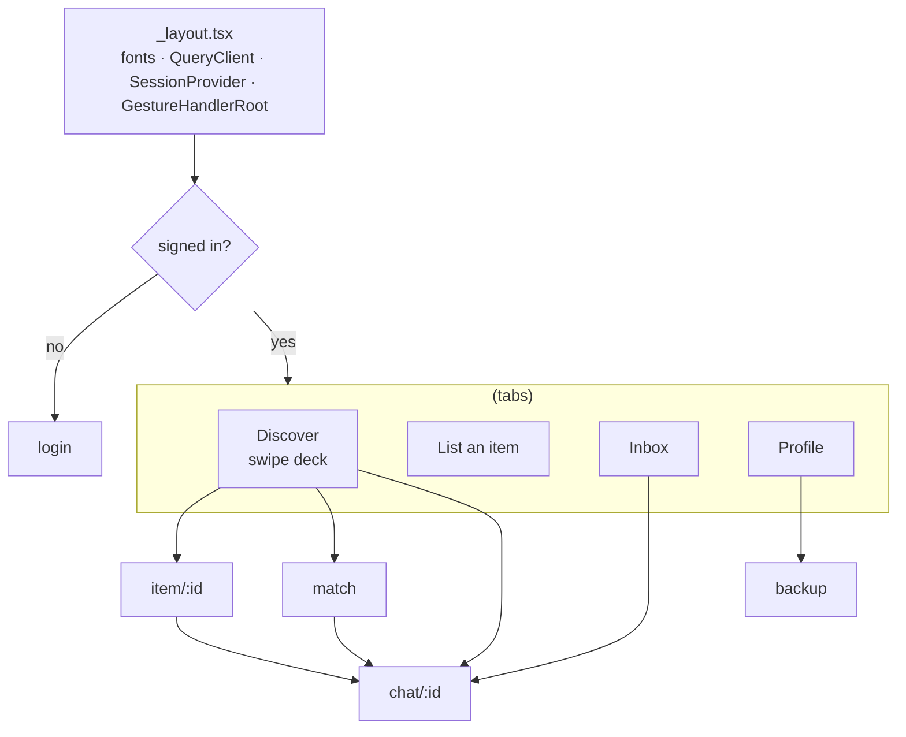
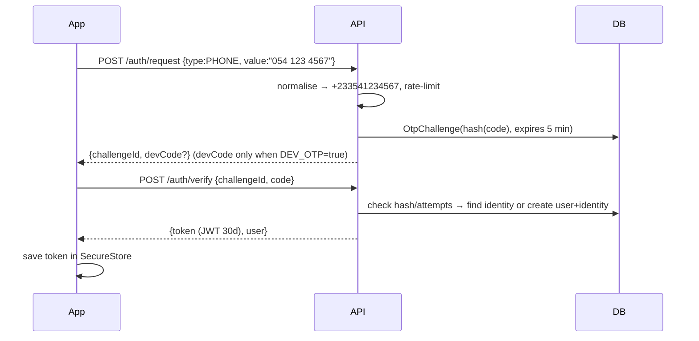
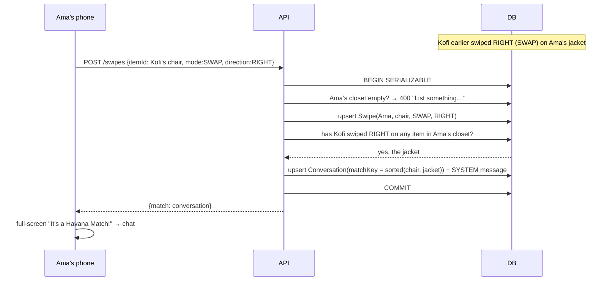
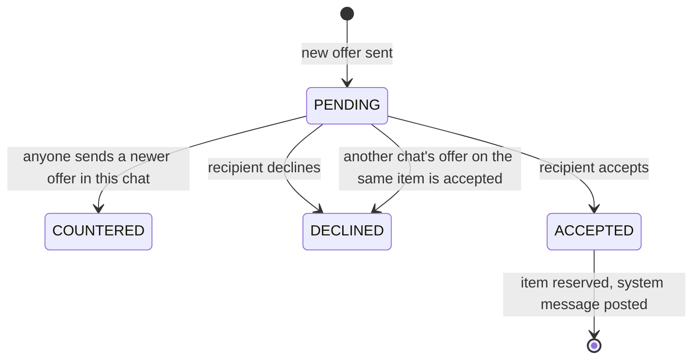

# Havana Architecture

This doc is for anyone joining the project: developers, and the AI agents working in this repo.
It explains how Havana is put together and why. For endpoint details see [`API_CONTRACT.md`](API_CONTRACT.md).
For setup see [`README.md`](README.md). For who is working on what right now see [`HANDOFF.md`](HANDOFF.md).

## 1. What Havana is

Havana is a Tinder-style second-hand marketplace for Accra. People swipe on used items to **buy**,
**haggle** with offers in chat, or **swap** one item for another. The app never handles money:
buyers and sellers pay each other directly (MoMo or cash on pickup).

## 2. System overview



- **One codebase per side:** `mobile/` is a single Expo (React Native) app for Android and iOS.
  `backend/` is a single NestJS service. Both are TypeScript.
- **No real-time channel in v1.** Chat and the inbox poll every 3 seconds, and only while the screen
  is visible and the app is in the foreground. That's simpler and works on flaky networks.
- **Stateless API.** Auth is a signed JWT (30 days), so the API can be restarted or scaled without sessions.

## 3. Repository layout

```
Havana App/
├── backend/                 NestJS + Prisma API
│   ├── prisma/
│   │   ├── schema.prisma    data model (source of truth for the DB)
│   │   ├── migrations/      SQL migrations, applied with `prisma migrate deploy`
│   │   └── seed.ts          6 demo sellers, 21 items around Accra, pre-seeded swap swipes
│   ├── src/
│   │   ├── main.ts          boot: listen on 0.0.0.0:$PORT
│   │   ├── app.ts           controllers (routes), module wiring, uploads, startup checks
│   │   ├── auth.ts          OTP request/verify, phone normalisation, JWT guard, OTP rate limit
│   │   ├── market.ts        profile, listings, feed ranking, swipes + swap matching, reports, ratings
│   │   ├── chat.ts          inbox, messages + polling cursor, offers (haggle), swap agree/done
│   │   ├── db.ts            PrismaClient + `atomic()` serializable transactions with retry
│   │   └── dto.ts           class-validator request DTOs
│   └── test/api.test.ts     HTTP integration tests against a real `havana_test` database
├── mobile/                  Expo Router app
│   ├── app/                 screens (file-based routes)
│   │   ├── _layout.tsx      fonts, providers, auth redirect, stack
│   │   ├── login.tsx        phone/email + OTP
│   │   ├── (tabs)/          Discover (index), List, Inbox, Profile
│   │   ├── item/[id].tsx    item page, haggle / swap / report
│   │   ├── chat/[id].tsx    chat, offers, swap header, ratings
│   │   ├── match.tsx        full-screen "It's a Havana Match!"
│   │   └── backup.tsx       attach a second login method
│   ├── src/
│   │   ├── api.ts           fetch wrapper: base URL, token, timeouts, friendly errors
│   │   ├── session.tsx      token in expo-secure-store, signed-in state
│   │   ├── SwipeCard.tsx    Reanimated + Gesture Handler card, stamps, price tag
│   │   ├── chat-cache.ts    merge logic for polled / paged messages (unit-tested)
│   │   ├── useScreenActive.ts  "focused and foreground" gate for polling
│   │   ├── ui.tsx           design tokens (colours) + shared components
│   │   └── types.ts         response types
│   └── eas.json             `preview` profile builds an installable APK
├── API_CONTRACT.md          every route, body and response
├── HANDOFF.md               live coordination log between the agents
└── docker-compose.yml       PostgreSQL 16 for local dev (or use Homebrew Postgres)
```

## 4. Backend

### 4.1 Request pipeline



- **Validation:** every body and query has a DTO in `dto.ts`. Unknown fields are rejected, so the
  phone app gets a clear 400 instead of silent data loss.
- **Errors:** services throw Nest HTTP exceptions with short, human messages ("This item is no
  longer available."). The app shows `message` as-is.
- **Concurrency:** anything that touches several rows (swipes that might match, accepting an offer,
  completing a swap, reports) runs in `Db.atomic()`. That's a Serializable transaction, retried up to 4 times on
  serialization conflicts and deadlocks. The tests fire two reciprocal swipes at once and check
  exactly one match is created.

### 4.2 Services

| Service | Owns | Notes |
|---|---|---|
| `Auth` (`auth.ts`) | OTP challenges, identities, JWT | Codes are 6 digits, HMAC-hashed, expire in 5 min, and allow at most 5 attempts. One request per identifier per minute; 20 `/auth/*` calls per IP per minute. `DEV_OTP=true` logs and returns the code; otherwise it POSTs `{type,value,code}` to `OTP_WEBHOOK_URL`. |
| `Market` (`market.ts`) | profile, items, feed, swipes, reports, ratings | Feed ranking and swap matching live here (see §6). |
| `Chat` (`chat.ts`) | conversations, messages, offers, swap progress | Polling cursor, offer state machine, swap agree/done. |

### 4.3 Data model



Key design choices:

- **Accounts vs logins.** `users` holds the person; `auth_identities` holds each verified phone or
  email (at most one of each per user). A backup login is just a second identity row, so
  one account works on both phones.
- **One conversation model for sales and swaps.** A sale chat has `swapItemId = null`. A swap
  match sets `swapItemId`. `matchKey` is unique (`shop:<buyer>:<item>` or the sorted pair of item
  ids), which makes "find or create" idempotent and stops duplicate matches.
- **Offers are messages.** An offer is a `Message` of type `OFFER` with `amount` + `offerStatus`.
  Status changes bump `updatedAt`, which is what the polling cursor watches.
- **Saved = a swipe.** A SHOP RIGHT swipe is a save. Unsaving flips it to LEFT, so the item doesn't come back into the feed.
- **Money is whole cedis (`Int`).** No floats, no minor units in v1.
- **Soft hide.** Three distinct reporters set `Item.hidden = true`. Nothing is deleted.

### 4.4 Extension points (designed in, not built)

| Later feature | Hook already in place |
|---|---|
| Short-stay rentals | `Item.kind` enum has `RENTAL`. The feed filters `kind: 'ITEM'` today. |
| Paystack payments / escrow | `Order` table with `amount`, `currency`, `status`, `providerReference`, `escrowMetadata`. V1 never writes to it. |
| Real SMS / email OTP | Set `DEV_OTP=false` and point `OTP_WEBHOOK_URL` at a sender (e.g. Hubtel, Arkesel). The API refuses to start without it. |
| Cloud photo storage | Photos are stored as paths (`/uploads/x.jpg`) and the app prefixes the API URL. Switch to absolute CDN URLs and the app keeps working, since `photoUrl()` passes absolute URLs through. |
| Real-time chat | Replace the 3s poll with WebSockets / SSE. The `since` cursor contract stays useful for catch-up after reconnects. |

## 5. Mobile app



- **Routing:** Expo Router (file-based). `_layout.tsx` redirects to `/login` when there is no token.
- **Server state:** TanStack Query for everything. There's no separate client store; the query cache
  *is* the app state. Mutations invalidate the affected keys (`feed`, `saved`, `inbox`, `me`, `chat`).
- **Auth token:** stored in `expo-secure-store`. Any 401 outside `/auth/*` signs the user out.
- **Networking (`api.ts`):** base URL from `EXPO_PUBLIC_API_URL`. Normal requests time out after 20s,
  uploads after 90s. Network failures become one friendly message ("Cannot reach Havana…").
  Server errors keep the HTTP status (`ApiError`), so screens can tell "item gone" (4xx) from "offline".
- **Polling:** `useScreenActive()` = focused **and** foreground **and** signed in. Inbox and chat only
  poll while that's true, which saves battery and data.
- **Swipe deck:** `SwipeCard` uses Gesture Handler + Reanimated on the UI thread. Right = want it or swap?,
  left = pass, up (Shop only) = make offer. Stamps fade in with drag distance. The tilted market price
  tag is mango (price) in Shop and hibiscus (swap value) in Swap.
- **Photos:** picked with `expo-image-picker`, resized to ≤1200px and JPEG 0.75 on the phone
  (`expo-image-manipulator`), then resized again server-side with `sharp` (1200px, q78). They're shown with
  `expo-image` using a memory+disk cache.
- **Design tokens (`ui.tsx`):** indigo `#23206B` brand, mango `#FFB020` buying/offers, hibiscus
  `#F0437B` swapping/matches, leaf `#1FA774` likes/safety, ink `#16152E`, muted `#6B6A86`, background
  `#F6F6FA`. Font: Bricolage Grotesque (500/700).

## 6. Key flows

### 6.1 Login (phone or email + OTP)



### 6.2 Discover feed ranking

1. Candidates: other people's `LIVE`, non-hidden `ITEM`s. SHOP needs `sell`, SWAP needs `swap`. Anything I
   already swiped on **in this mode** is excluded. Optional category filter. Newest 500.
2. Viewer location: query lat/lng → saved profile location → central Accra (5.6037, −0.187).
3. Score (lower is better) = `distanceKm (30 if unknown) + 0.35 × ageDays (capped at 60) + 12 × valueGap`.
   `valueGap` (SWAP only) is the smallest relative difference between the item's swap value and anything in my closet.
4. Return the best 30. When the deck runs out, the app asks again; swiped items have dropped out by then.

### 6.3 Swap match



After the match, both people tap **We agreed**, meet, then both tap **Swap done**. Only then are
both items marked `SWAPPED` and the conversation `completedAt` set.

### 6.4 Haggle (offer state machine)



Only the person who did **not** send an offer can accept or decline it. Accepting reserves the item
and declines every other pending offer on it, in one transaction. Quick chips (asking, −10%, −20%, −30%)
are calculated on the phone.

### 6.5 Chat polling

```
first open:   GET /conversations/:id/messages            → latest 100 + cursor
every 3s:     GET /conversations/:id/messages?since=cursor → new messages + offers whose status changed
older page:   GET /conversations/:id/messages?before=<createdAt of oldest>
```

The server's cursor is "query time minus 5s". That overlap covers transactions that commit
late. The phone merges by message id (`chat-cache.ts`), so the overlap never shows duplicates.

## 7. Trust & safety

- Ratings (1–5): only between two people who have **both** sent a TEXT/OFFER in a shared chat.
  One rating per pair; rating again replaces it.
- Reports: one per user per item; 3 distinct reporters auto-hide the item.
- Safety copy ("Meet in public · Check before paying · MoMo or cash directly") appears on login,
  profile, the item page and every chat. Each new sale chat opens with a safety SYSTEM message.
- Uploads: only images (jpeg/png/webp), max 5 MB each and 6 per request. They're re-encoded by `sharp` (strips
  metadata, including GPS), and listings may only reference photos the same user uploaded.
- Startup checks: the API refuses to boot with a short `JWT_SECRET`, or with `DEV_OTP=true` in production.

## 8. Environments & quality gates

| | Where | How |
|---|---|---|
| Dev DB | Docker (`docker compose up -d`) or Homebrew Postgres (`havana`) | `npm run db:migrate && npm run db:seed` |
| Test DB | database name must contain `havana_test` (tests truncate it) | `DATABASE_URL=…/havana_test npm test` |
| API | laptop, `0.0.0.0:3000` | `npm run dev` in `backend/` |
| App | Expo Go on both phones, same Wi-Fi | `EXPO_PUBLIC_API_URL=http://<laptop-ip>:3000`, `npx expo start --lan` |
| APK | EAS `preview` profile | the API URL in `eas.json` is baked into the build |

Before anything is called done: root `npm run typecheck` and `npm run lint` (backend + mobile),
backend `npm test` (HTTP integration tests), and mobile `npm test` (chat-cache unit tests).

## 9. Known limits of v1

- One API process with photos on its local disk. Move photos to object storage before running more than one API process.
- Polling, not push. There are no notifications when the app is closed.
- The feed ranks in memory over the newest 500 candidates. Fine for launch, but move to SQL/PostGIS
  ranking as listings grow.
- No admin tool. Reports can only be reviewed in the database.
